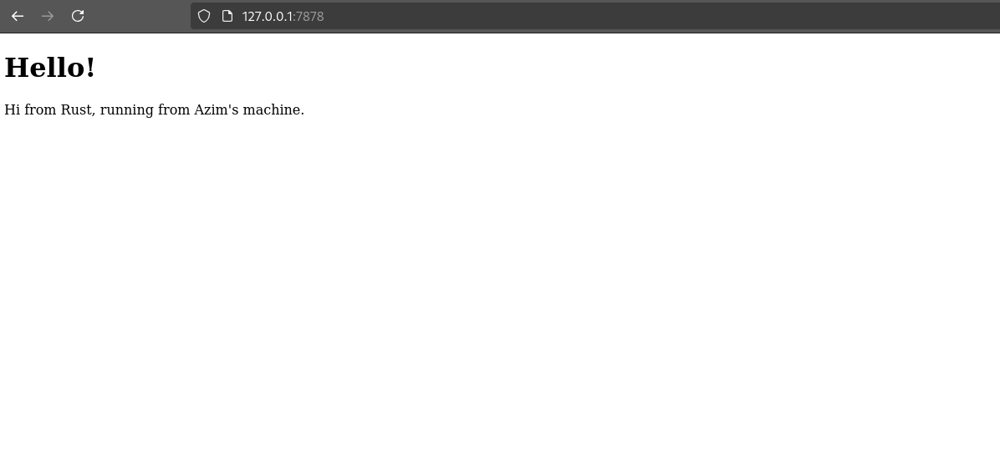
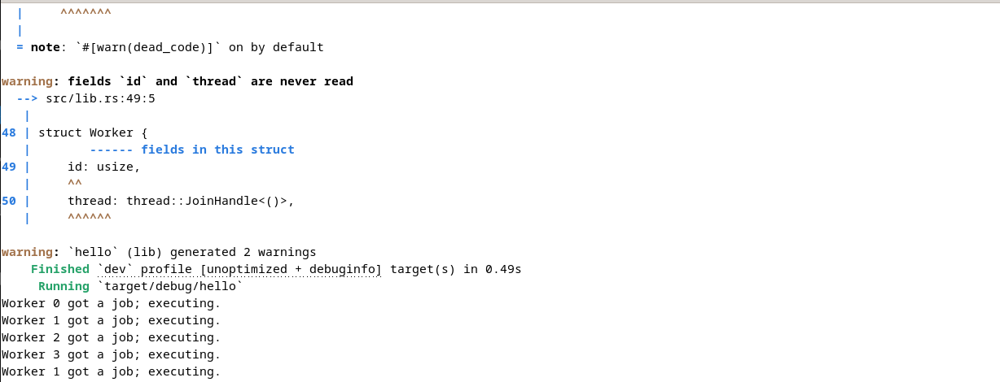

# Reflection 

## How does the handle_connection work ? What's inside it ?
  
  ## Commit 1 :
 - ```rust
    fn handle_connection(mut stream: TcpStream) {
	```
	The function takes a TcpStream as an argument. This object is used to collect to request made when an user connects to the URL using the TCP protocol.

 - ```rust
    let  buf_reader  =  BufReader::new(&mut  stream);
	```
	The buf_reader is used to allow us to read the request line by line, instead of reading everything at once. 

 - ```rust
    let  http_request:  Vec<_> = buf_reader...
	```
	We stock the request in a Vector of String extracting the informations from the buf_reader.

 - ```rust
    .lines()
	```
	This returns an iterator of the BufReader that reads lines from buf_reader.

 - ```rust
    .map(|result|  result.unwrap())
	```
	This applies the unwrap() function to each result.

 - ```rust
    .take_while(|line|  !line.is_empty())
	```
	This stops reading when it encounters an empty line(""). 

 - ```rust
	.collect();
	```
	This collects all the processed lines into a Vec<String>.
	
## Commit 2 :

- ```rust
	let status_line = "HTTP/1.1 200 OK";
	```
This defines the first line of the HTTP response, indicating a 200 OK status (success).

- ```rust
	let contents = fs::read_to_string("hello.html").unwrap();
	```
This line reads the hello.html file and stores its content in the contents variable.

- ```rust
	let length = contents.len();
	```
The content length is calculated to define the Content-Length header, which is necessary when sending an http response.

- ```rust
	let response =
    format!("{status_line}\r\nContent-Length: {length}\r\n\r\n{contents}");
	```
Here, we format the complete HTTP response, including:
1. The status line (status_line).
2. The Content-Length header, which is essential to inform the client about the response body size.
3. A blank line (\r\n\r\n), separating headers from the body.
4. The HTML file content (contents).

- ```rust
	stream.write_all(response.as_bytes()).unwrap();
	```
Finally, the response is sent to the client using stream.write_all().
unwrap() ensures that any write error will cause the program to panic.


## Commit 3 :

Previously, our web server responded with hello.html regardless of the requested URL. Now, we have modified handle_connection to distinguish between valid and invalid requests:
1. If the request is for /, the server responds with hello.html (HTTP 200 OK).
2. Otherwise, it responds with 404.html (HTTP 404 NOT FOUND).

```rust
	let buf_reader = BufReader::new(&stream);
	let request_line = buf_reader.lines().next().unwrap().unwrap();
```
We read only the first line of the HTTP request instead of storing all lines in a Vec<String>. And, next().unwrap().unwrap() ensures that we retrieve and unwrap the first line safely.

- ```rust
	if request_line == "GET / HTTP/1.1" {
  ```
If the request matches GET / HTTP/1.1, we serve hello.html. Otherwise, we return a 404 NOT FOUND response.

- ```rust
	let status_line = "HTTP/1.1 200 OK";
	let contents = fs::read_to_string("hello.html").unwrap();
	```
	We read hello.html if the request is valid. Otherwise, we return:

	- ```rust
		let status_line = "HTTP/1.1 404 NOT FOUND";
		let contents = fs::read_to_string("404.html").unwrap();
		```
- ```rust
	let response = format!("{status_line}\r\nContent-Length: {length}\r\n\r\n{contents}");
	stream.write_all(response.as_bytes()).unwrap();
	```
	The response is formatted properly with status, content length, and body.


### Why Refactoring is Needed

Initially, we had redundant code in both if and else blocks. To improve maintainability and readability, we refactored the logic.

- Before Refactoring: 

```rust
	if request_line == "GET / HTTP/1.1" {
		let status_line = "HTTP/1.1 200 OK";
		let contents = fs::read_to_string("hello.html").unwrap();
		let length = contents.len();
		
		let response = format!("{status_line}\r\nContent-Length: {length}\r\n\r\n{contents}");
		stream.write_all(response.as_bytes()).unwrap();
	} else {
		let status_line = "HTTP/1.1 404 NOT FOUND";
		let contents = fs::read_to_string("404.html").unwrap();
		let length = contents.len();
		
		let response = format!("{status_line}\r\nContent-Length: {length}\r\n\r\n{contents}");
		stream.write_all(response.as_bytes()).unwrap();
	}
```

- After Refactoring: 

```rust
	let (status_line, filename) = if request_line == "GET / HTTP/1.1" {
    	("HTTP/1.1 200 OK", "hello.html")
	} else {
    	("HTTP/1.1 404 NOT FOUND", "404.html")
	};

	let contents = fs::read_to_string(filename).unwrap();
	let length = contents.len();

	let response = format!("{status_line}\r\nContent-Length: {length}\r\n\r\n{contents}");

	stream.write_all(response.as_bytes()).unwrap();
```

- Improvements of Refactoring:

	1. Eliminate Redundant Code
	2. Improve Readability
	3. Enhance Maintainability


### Screenshots

- If we try to access http://127.0.0.1:7878 :



- If we try to access http://127.0.0.1:7878/bad:


## Commit 4 

### Code changes

- We add the following request handling: 

```rust
	"GET /sleep HTTP/1.1" => {
    thread::sleep(Duration::from_secs(10));
    ("HTTP/1.1 200 OK", "hello.html")
}
```
Which means that if we try to access to http://127.0.0.1:7878/sleep, the server will first wait for 10 seconds and then print the Hello page.

### Consequences

We observe that if we try access to http://127.0.0.1:7878 in parallel of http://127.0.0.1:7878/sleep, then it will also be slow.

### Why is it highlighting an issue?

It shows that a single-threaded server processes requests sequentially, meaning one slow request blocks all others. Here accessing the http://127.0.0.1:7878/sleep page blocks the access of the http://127.0.0.1:7878 page.


## Commit 5

- ```rust
    let pool = ThreadPool::new(4);
  ```
This initializes a thread pool with 4 worker threads to handle multiple requests concurrently.

- ```rust
    for stream in listener.incoming() {
        let stream = stream.unwrap();
        pool.execute(|| {
            handle_connection(stream);
        });
    }
  ```
This loop listens for incoming TCP connections, and each request is passed to the thread pool for handling in a separate thread.

- ```rust
    pub struct ThreadPool {
        workers: Vec<Worker>,
        sender: mpsc::Sender<Job>,
    }
  ```
The `ThreadPool` struct manages worker threads and a sender channel for dispatching jobs.

- ```rust
    let (sender, receiver) = mpsc::channel();
  ```
This creates a multi-producer, single-consumer (mpsc) channel for sending jobs to worker threads.

- ```rust
    let receiver = Arc::new(Mutex::new(receiver));
  ```
The receiver is wrapped in `Arc<Mutex<T>>` to allow multiple threads to safely access the shared queue of jobs.

- ```rust
    struct Worker {
        id: usize,
        thread: thread::JoinHandle<()>,
    }
  ```
The `Worker` struct represents a single thread in the pool, storing an ID and a thread handle.

- ```rust
    fn new(id: usize, receiver: Arc<Mutex<mpsc::Receiver<Job>>>) -> Worker {
  ```
The `Worker::new` function spawns a new thread that listens for incoming jobs from the shared receiver queue.

- ```rust
    let message = receiver.lock().unwrap().recv();
  ```
This locks the receiver, waits for a job to be received, and handles errors if the channel is closed.

- ```rust
    match message {
        Ok(job) => {
            println!("Worker {id} got a job; executing.");
            job();
        }
        Err(_) => {
            println!("Worker {id} disconnected; shutting down.");
            break;
        }
    }
  ```
Each worker waits for jobs, executes them when available, and shuts down gracefully when the sender is closed.


### Screenshot

- Screenshot of the result in the terminal of several different requests to the server :


